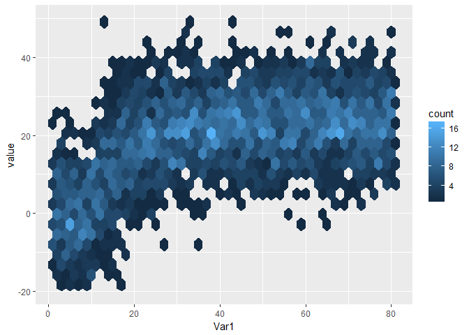

<!-- README.md is generated from README.Rmd. Please edit that file -->
 

ssmcmc
======

The goal of ssmcmc is to ...

Example
-------

This is a basic example which shows you how to solve a common problem:

    #> Warning: Removed 6 rows containing non-finite values (stat_binhex).

    #> Warning: Removed 101 rows containing non-finite values (stat_binhex).

