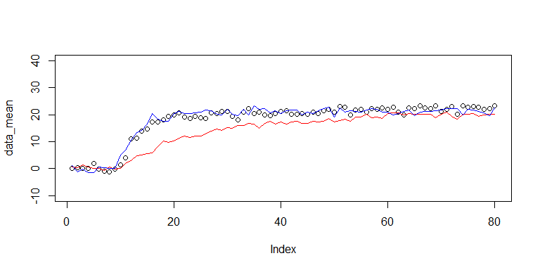
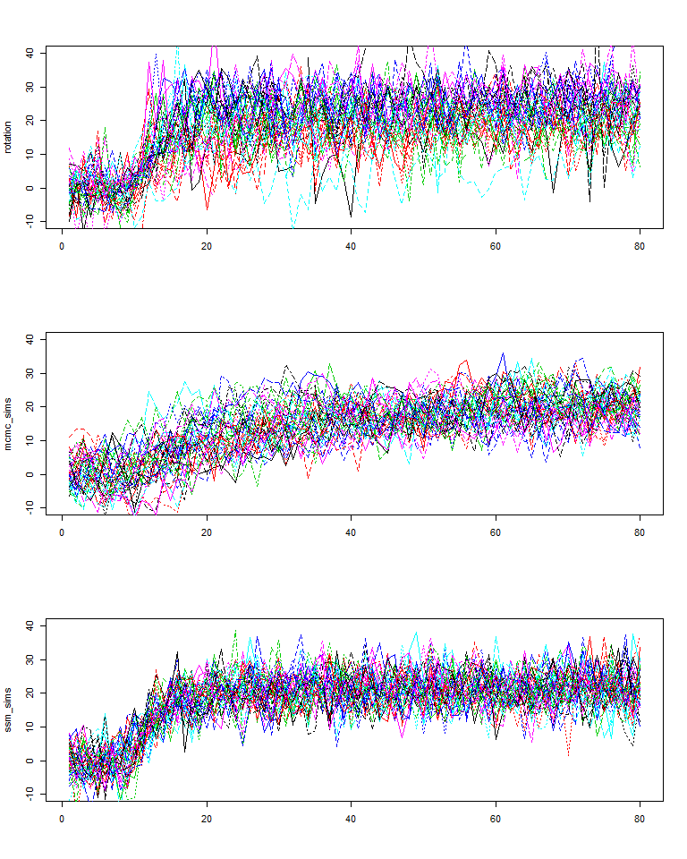

<!-- README.md is generated from README.Rmd. Please edit that file -->
[](https://travis-ci.org/aforren1/ssmcmc) [](https://ci.appveyor.com/project/aforren1/ssmcmc)

ssmcmc
======

The goal of ssmcmc is to ...

Example
-------

This is a basic example which shows you how to solve a common problem:

``` r
set.seed(1)
data_mean <- rowMeans(rotation, na.rm = TRUE)
mcmc_sims <- replicate(n = 40,
                       expr = simulate_mcmc(optimal = c(rep(0, 8), rep(30, 72)), 
                                            cost_width = 6,
                                            forget_rate = 0.85,
                                            proposal_variance = 6.5))
ssm_sims <- replicate(n = 40,
                      expr = simulate_ssm(optimal = c(rep(0, 8), rep(30, 72)), 
                                          learn_rate = 0.15,
                                          forget_rate = 0.94,
                                          process_variance = 1,
                                          execution_variance = 5))
```

``` r
plot(data_mean, ylim = c(-10, 40))
lines(rowMeans(mcmc_sims), col = 'red')
lines(rowMeans(ssm_sims), col = 'blue')
```



``` r
par(mfrow = c(3, 1))

matplot(rotation, type = 'l', ylim = c(-10, 40))
matplot(mcmc_sims, type = 'l', ylim = c(-10, 40))
matplot(ssm_sims, type = 'l', ylim = c(-10, 40))
```



``` r
par(mfrow = c(1, 1))
```
